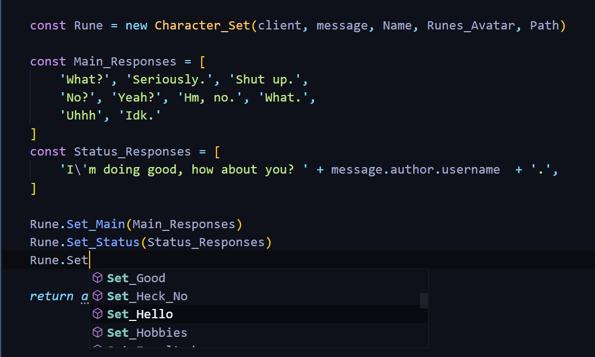
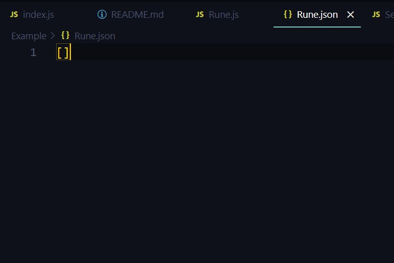
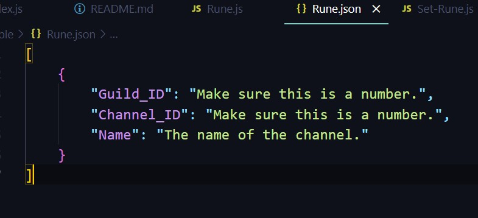

# Discord Character

## Description
`discord-character` is a basic project that allows you to **create your own Discord Chatbots.**

## Requirements
**Node.js 16.6.0 or newer is required.**
- [`discord.js`](https://discord.js.org/#/)

## Features
- Easy-to-use
- Beginner-Friendly
- Discord Webhooks

- - -

## Classes
There are 2 Character Classes you can use:
- `Character_Set`
- `Character`

### Character_Set
Is an already set up Character Class; Already built-in responses; AI.


### Character
A completely empty Character Class.
You can manually add custom responses to
specific words using Arrays of String(s).

- - -

## Examples

### Set Up
Path has to be an empty Array.


```js
const { Character_Set, Character } = require('discord-character')

client.on('messageCreate', async message => {
    if (message.author.bot) return;

    const Name = 'Rune'
    const Runes_Avatar = 'https://cdn.discordapp.com/avatars/781224758355820555/de3ad39b494018d9e42336610d7691ef.jpg?size=4096'
    
    const Path = 'The Path to your JSON file as a storage.'

    // The rest of the code goes here...
})
```

### Character_Set
```js
const Rune = new Character_Set(client, message, Name, Runes_Avatar, Path)

const Main_Responses = [
    'What?', 'Seriously.', 'Shut up.',
    'No?', 'Yeah?', 'Hm, no.', 'What.',
    'Uhhh', 'Idk.'
]
const Status_Responses = [
    'I\'m doing good, how about you? ' + message.author.username  + '.',
]

Rune.Set_Main(Main_Responses)
Rune.Set_Status(Status_Responses)

return await Rune.Chat()
```

### Character
```js
const Rune = new Character(client, message, Name, Runes_Avatar, Path)

const Main_Responses = [
    'What?', 'Seriously.', 'Shut up.',
    'No?', 'Yeah?', 'Hm, no.', 'What.',
    'Uhhh', 'Idk.'
]
Rune.Set_Main(Main_Responses)

const Mitch = [ 'Mitch' ]
const Mitch_Responses = [
    'Oh no-', 'Oh no.', 'Uh oh-', 'Uh oh.'
]

const A = [ 'A', 'EA' ]
const A_Responses = [ 'A.', 'a.', 'EA.', 'ea.' ]
Rune.Add_Response(Mitch, Mitch_Responses, 2)
Rune.Add_Response(A, A_Responses, 1)

return await Rune.Chat()
```

### Character.js
If you want a per-server chatbot(s).

```js
module.exports = {
    name: 'set-rune',
    description: 'Sets the channel for Rune.',
    async execute(client, message, args) {
        const Permission = new Discord.MessageEmbed()
        .setAuthor(client.user.username, client.user.displayAvatarURL({ dynamic: true }))
        .setDescription('```You dont have any permission to use this command.```')
        .setColor("#c98aff")
        if (!message.member.permissions.has("ADMINISTRATOR" || !message.member.permissions.has("MANAGE_SERVER"))) return message.channel.send({ embeds: [ Permission ] })

        const Path = 'The Path to your JSON file as a storage.'
        let Runes_Channels = Open(Path)

        const Runes_Channel = Runes_Channels.find(Runes_Channel => {
            return Runes_Channel.Guild_ID === parseInt(message.guild.id)
        })

        const Provide_Channel = new Discord.MessageEmbed()
        .setAuthor(message.guild.name, message.guild.iconURL({ dynamic: true }))
        .setTitle('You need to provide a channel.')
        .setDescription('```M!set-rune <Channel>```')
        .setColor("#c98aff")
        const Already_Been = new Discord.MessageEmbed()
        .setAuthor(message.guild.name, message.guild.iconURL({ dynamic: true }))
        .setDescription('```That channel has already been set as Rune\'s Channel.```')
        .setColor("#c98aff")

        const Channel = message.mentions.channels.first()
        if (!Channel && Runes_Channel !== undefined) {
            Provide_Channel.addField('Rune\'s Channel', `\`\`\`${Runes_Channel.Name || 'Has not been set.'}\`\`\``)
            return message.channel.send({ embeds: [ Provide_Channel ] })
        }
        if (!Channel && !Runes_Channel) {
            Provide_Channel.addField('Rune\'s Channel', `\`\`\`Has not been set.\`\`\``)
            return message.channel.send({ embeds: [ Provide_Channel ] })
        }
        if (Runes_Channel !== undefined && parseInt(Channel.id) === Runes_Channel.Channel_ID) return message.channel.send({ embeds: [ Already_Been ] })

        const Set = new Discord.MessageEmbed()
        .setAuthor(message.guild.name, message.guild.iconURL({ dynamic: true }))
        .setTitle('Rune\'s Channel has been set.')
        .setDescription(`\`\`\`You can now chat with Rune in ${Channel.name}\`\`\``)
        .setColor("#c98aff")

        if (!Runes_Channel) {
            Set_Rune()
            Save(Runes_Channels, Path)

            return message.channel.send({ embeds: [ Set ] })
        }

        Runes_Channels = Runes_Channels.filter(Runes_Channel => {
            return Runes_Channel.Guild_ID !== parseInt(message.guild.id)
        })

        Set_Rune()
        Save(Runes_Channels, Path)

        return message.channel.send({ embeds: [ Set ] })

        function Set_Rune() {
            Runes_Channels.push(
                {
                    Guild_ID: parseInt(message.guild.id),
                    Channel_ID: parseInt(Channel.id),
                    Name: Channel.name
                }
            )
        }
    }
}
```

if you don't, then just set it up like this.


- - -

## Miscellaneous
These uses the [`fs`](https://nodejs.org/api/fs.html) module.

```js
const { Open, Save } = require('discord-character')

const Path = './Responses/Rune.json'

const Responses = Open(Path)
console.log(Response)

Responses.push( /* Add anything here. */ )
Save(Responses)
```